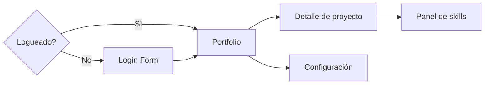
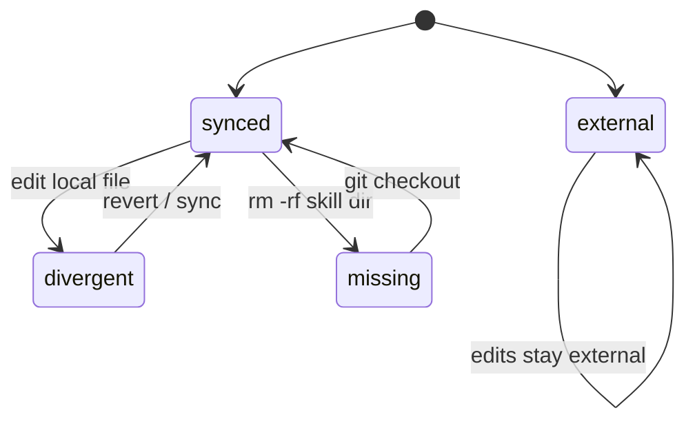
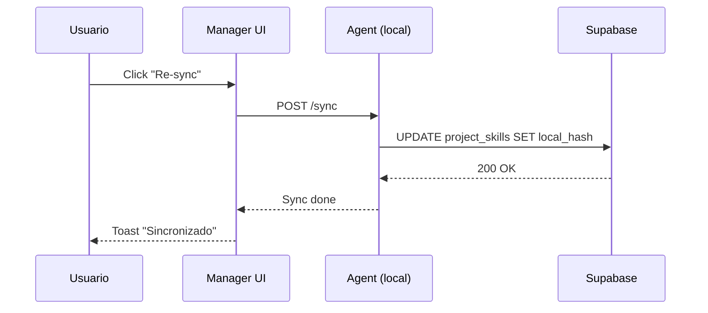
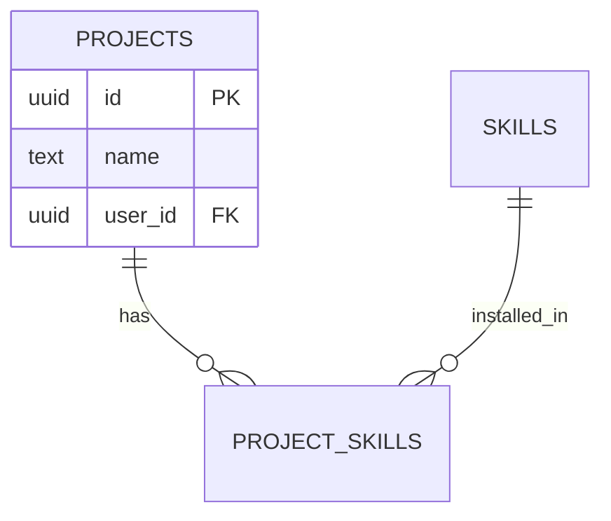

# Mermaid Cheatsheet — sintaxis validada

> Usar **solo** estos tipos. No inventar. Mermaid es estricto: un identificador con espacios o un caracter raro rompe el render.

## 1. Flowchart (screen flow)

**Reglas:**
- `LR` = left-right. `TD` = top-down.
- `[Texto]` = caja rectangular (pantalla)
- `{Texto}` = diamante (decisión, ej: auth gate)
- `((Texto))` = círculo (estado terminal)
- `>Texto]` = etiqueta (acción/evento)
- Identificadores: solo letras/números/guiones. **Sin espacios** en los IDs (sí en los textos entre corchetes).
- Etiquetas en flechas: `-->|Texto|`

## 2. State diagram (estados de entidades)

**Reglas:**
- `[*]` = estado inicial / final
- `state1 --> state2: trigger` = transición con etiqueta
- Estados como identificadores simples (sin espacios)
- Si hace falta texto largo: `state "Texto largo" as id1`

## 3. Sequence diagram (interacción entre actores)

Útil para flujos que cruzan Manager + Agent + DB.

**Reglas:**
- `participant X as "Texto"` = define actor
- `A->>B: msg` = mensaje síncrono
- `A-->>B: msg` = respuesta (línea punteada)
- `Note over A,B: texto` = anotación

## 4. ER diagram (modelo de datos)

Solo si el `WORKFLOW.md` necesita mostrar entidades y relaciones (en general no — eso vive en `BUSINESS_LOGIC.md`).

## Errores comunes (no cometer)

| ❌ Mal | ✅ Bien |
|--------|---------|
| `flowchart LR\nMy Screen --> Other` | `flowchart LR\nMyScreen --> Other` (sin espacios en ID) |
| `state1 --> state2: edit (delete)` | `state1 --> state2: edit/delete` (paréntesis se pueden cortar) |
| `flowchart\nA --> B` | `flowchart LR\nA --> B` (siempre dirección) |
| `sequenceDiagram\nA->B: msg` | `sequenceDiagram\nA->>B: msg` (doble flecha) |

## Validación rápida

Antes de escribir el bloque al archivo, **mentalmente "renderizar"**:
1. ¿Cada nodo tiene ID válido (sin espacios)?
2. ¿Cada flecha tiene origen y destino existentes?
3. ¿Las etiquetas con caracteres especiales están escapadas o evitadas?
4. ¿El primer renglón declara tipo + dirección?

Si hay duda, copiar el bloque y pegarlo en https://mermaid.live para verificar antes de commitear.
