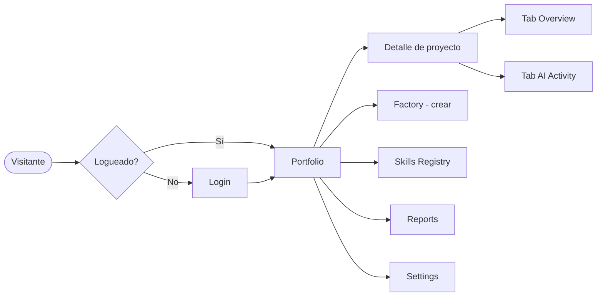
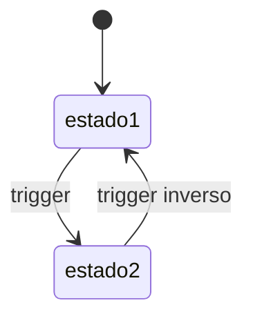
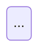

# WORKFLOW.md — Template

> Este es el formato exacto del archivo que produce el skill `flow-map`. Copiá, completá, adaptá.
> El archivo final vive en la **raíz del proyecto** como `WORKFLOW.md`.

---

```markdown
# {Nombre del proyecto} — Workflow

> Última actualización: {YYYY-MM-DD}
> Generado/actualizado por skill `flow-map`

## 1. Resumen narrativo

{3-5 oraciones en lenguaje natural, no técnico, sobre qué hace la app y para quién.
Si un inversor lee solo esto, tiene que entender el producto.}

Ejemplo:
"Factory Manager es un Business OS para gestionar una fábrica de software.
Permite ver todos los proyectos en un dashboard, monitorear cuánto tiempo y
plata se invierte en cada uno, sincronizar skills (capacidades) entre el
catálogo central y cada proyecto, y reportar costos por hora. Lo usa
principalmente el dueño de la fábrica para decisiones de negocio."

---

## 2. Personajes (quién la usa)

| Personaje | Qué busca | Pantalla principal |
|-----------|-----------|-------------------|
| Dueño / Founder | Visión general de su portafolio | `/dashboard` |
| Operador | Sincronizar y mantener proyectos | `/project/[name]` |
| {agregar más} | | |

---

## 3. Screen flow (mapa de pantallas)



---

## 4. State diagrams (estados de entidades)

### Entidad: `{nombre_entidad}`

{Una línea de descripción}



### Entidad: `{otra_entidad}`



---

## 5. Event catalog (mensajes que ve el usuario)

| Evento (interno) | Trigger | Mensaje al usuario | Dónde aparece |
|-----------------|---------|-------------------|---------------|
| skill_synced | hash local = registry | "Sincronizado con catálogo" (tooltip) | Badge verde en SkillPanel |
| skill_divergent | hash local ≠ registry | "Difiere del catálogo" (tooltip) | Badge ámbar en SkillPanel |
| skill_missing | local_hash NULL | "Falta el skill" (tooltip) | Badge rojo en SkillPanel |
| skill_external | registry_hash NULL | "Skill custom" (tooltip) | Badge gris en SkillPanel |
| sync_completed | sync exitoso | Toast "Sincronizado" | Top-right |
| {agregar todos los toasts/badges/alerts} | | | |

---

## 6. Intent map (frases naturales → acciones)

> El núcleo del asistente AI. Cada fila es una capacidad que el chatbot expone.

| Categoría | Frase del usuario | Intención | Acción / target |
|-----------|------------------|-----------|----------------|
| navegación | "muéstrame mis proyectos" | list_portfolio | navegar a `/dashboard` |
| navegación | "abrí el de delivery" | open_project | navegar a `/project/{name}` filtrando por nombre |
| filtro | "qué proyectos tienen problemas" | filter_problematic | `/dashboard?status=divergent,missing` |
| explicación | "por qué add-emails está raro" | explain_skill_state | leer estado de skill X y traducir con glosario |
| acción | "sincronizá este proyecto" | sync_project | ejecutar action sync(project_id) |
| acción | "creame uno nuevo de {tema}" | new_project | navegar a `/factory` con preset |
| reporte | "cuánto gasté en {proyecto}" | cost_report | leer costs y formatear |
| {agregar 10+ mínimo} | | | |

---

## 7. Glosario (técnico → humano)

| Término técnico | Traducción no-técnica |
|----------------|----------------------|
| synced | "Todo en orden, no hay diferencias" |
| divergent | "El skill local tiene cambios que no están en el catálogo" |
| missing | "El skill se borró del proyecto pero queda registrado" |
| external | "Skill custom de este proyecto, no está en el catálogo" |
| RLS | "Reglas de seguridad de la base de datos" |
| {agregar todos los términos que aparecen en la UI} | |

---

## 8. Notas para el asistente IA

> Esta sección es leída por `fluya-ai-agent` como parte del system prompt.

**Tono:** {ej: "amigable, argentino, sin jerga técnica"}

**Reglas duras:**
- Nunca exponer IDs internos al usuario
- Si una intención no está en el intent map, responder "no estoy seguro, ¿podés contarme un poco más?"
- Para acciones destructivas (eliminar proyecto, etc.), siempre confirmar dos veces

**Ejemplos de buenas respuestas:**

User: "¿por qué add-emails está raro en SaasFactoryManager?"
Assistant: "Está marcado como 'divergent' — eso significa que el archivo local
del skill tiene cambios que no están en el catálogo central. Probablemente
alguien lo editó directo. Si querés que vuelva a estar igual al catálogo,
tocá 'Re-sync'. Si querés mandar tus cambios al catálogo, hay que hacerlo
desde el SF Agent."

---

> **Cómo regenerar este archivo**: ejecutar `/flow-map` en la raíz del proyecto.
> En modo update, el skill detecta este archivo y solo pregunta lo que cambió.
```

---

## Notas para Claude (al usar este template)

1. **Llenar TODAS las secciones**. Si una está vacía, el asistente IA pierde contexto.
2. **Intent map mínimo: 10 filas**. Si el humano da menos, presionar con ejemplos.
3. **Glosario mínimo: todos los términos técnicos que aparecen en la UI.** No inventes — leé el codebase.
4. **Mermaid validado**: ver `mermaid-cheatsheet.md`. Sintaxis estricta.
5. **Idioma del archivo**: español si el proyecto está en español, inglés si está en inglés. Mirá `BUSINESS_LOGIC.md` y comentarios del código para inferir.
