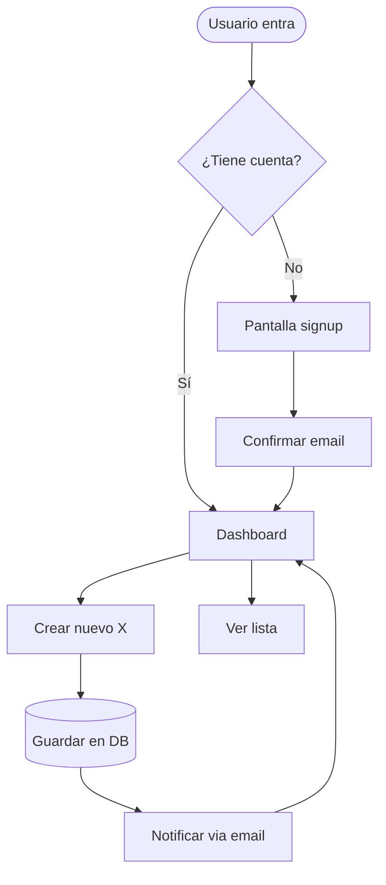
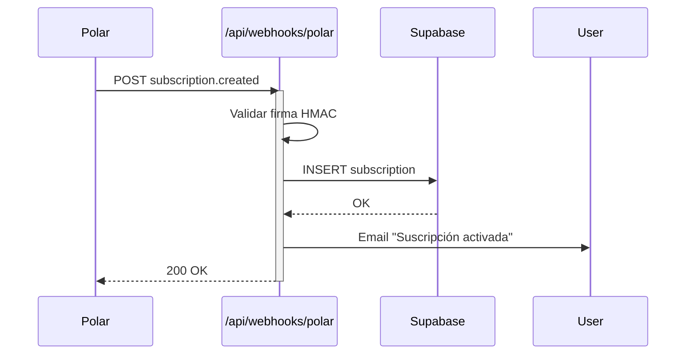
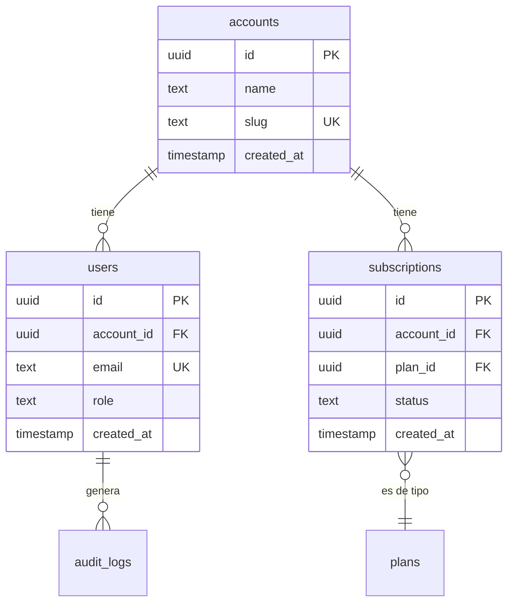
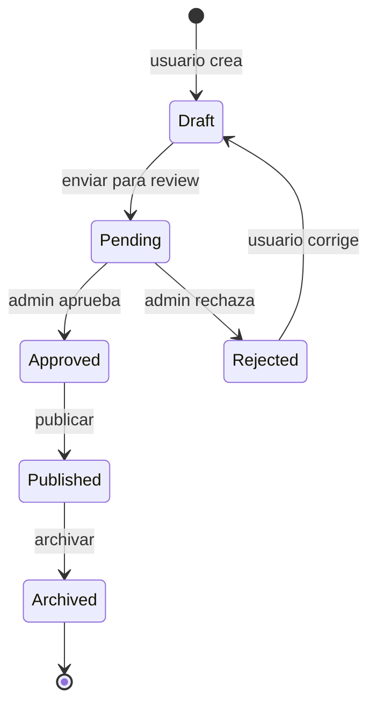
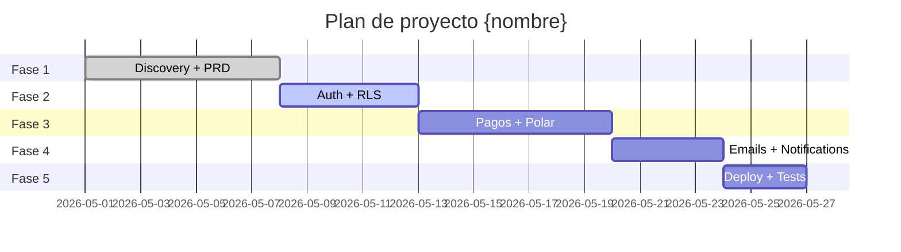
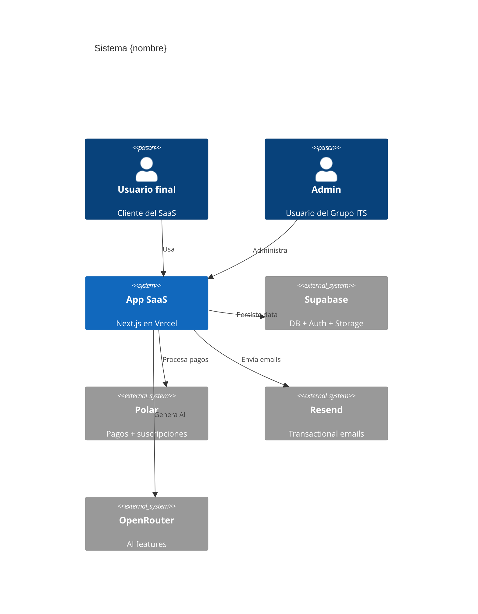

# Genera Mermaid — Diagramas visuales automáticos

> Origen: $ARGUMENTS (PRD path, código path, o "libre")

Sos el especialista en generar **diagramas Mermaid** a partir de la información del proyecto. Mermaid es un formato de texto que GitHub, GitLab, Notion, Obsidian y la mayoría de IDEs renderean automáticamente como diagramas.

## Tipos de diagramas que generás

1. **Flowchart** — flujos de usuario (user journey)
2. **Sequence diagram** — interacción entre componentes/servicios (ej: webhook flow)
3. **ER diagram** — schema de base de datos
4. **State diagram** — estados de un recurso (ej: order: pending → paid → shipped)
5. **Gantt** — planificación de fases del proyecto
6. **C4 diagram** — arquitectura del sistema (Context, Container, Component)
7. **Class diagram** — modelos de datos OOP

## Proceso

### Paso 1: Detectar fuente

`$ARGUMENTS` puede ser:
- `prd` o path a `06-prd.md` → leer el PRD y generar diagramas de las features
- `db` o path a schema/migrations → generar ER diagram
- `code` → analizar `src/` y generar diagramas de arquitectura
- `flow:nombre` → generar flowchart de un proceso específico
- "libre" → preguntar al dev qué quiere

### Paso 2: Preguntar qué diagramas (si no es claro)

Si la fuente no especifica qué diagramas, preguntar:

```
¿Qué diagramas querés que genere?

1. Flowchart de user journey
2. Sequence diagram (ej: signup flow, payment flow, webhook)
3. ER diagram de la DB
4. State diagram (ej: estados de un order)
5. Gantt de fases del proyecto
6. C4 diagram de arquitectura
7. Todos los aplicables

(podés elegir varios separados por coma)
```

### Paso 3: Generar el/los diagramas

#### 3.1 Flowchart (user journey)

Plantilla:


#### 3.2 Sequence diagram (webhook flow)

Plantilla para webhook Polar → DB:


#### 3.3 ER diagram (schema)



#### 3.4 State diagram (lifecycle de un recurso)



#### 3.5 Gantt (fases del proyecto)



#### 3.6 C4 Context diagram (arquitectura)



### Paso 4: Guardar los diagramas

Por cada diagrama generado, crear archivo en `outputs/diagramas/`:

```
outputs/
└── diagramas/
    ├── 01-flow-signup.md
    ├── 02-sequence-webhook-polar.md
    ├── 03-er-schema.md
    ├── 04-state-order.md
    ├── 05-gantt-proyecto.md
    └── 06-c4-arquitectura.md
```

Cada archivo:

```markdown
# Diagrama: {título}

> Tipo: {flowchart/sequence/er/state/gantt/c4}
> Generado: {fecha}
> Origen: {prd/db/code/libre}

## Descripción

{1-2 párrafos explicando qué muestra el diagrama}

## Diagrama

\`\`\`mermaid
{código mermaid}
\`\`\`

## Cómo se ve

> Este diagrama se renderea automáticamente en:
> - GitHub (en cualquier .md de un repo)
> - GitLab (idem)
> - Notion (block "Code" con lenguaje "mermaid")
> - Obsidian, Logseq, Joplin
> - VS Code con extensión "Markdown Preview Mermaid Support"
> - Vercel preview de markdowns

## Actualizar

Para actualizar este diagrama, editá el código entre los \`\`\`mermaid \`\`\` arriba.
Validar sintaxis en: https://mermaid.live/
```

### Paso 5: Embeber en docs del proyecto

Opcional pero recomendado: agregar referencias en `bitacora.md`:

```markdown
## {fecha} — Diagramas generados

Generados con /genera-mermaid:
- [Flow Signup](outputs/diagramas/01-flow-signup.md)
- [ER Schema](outputs/diagramas/03-er-schema.md)
- [C4 Arquitectura](outputs/diagramas/06-c4-arquitectura.md)
```

### Paso 6: Cierre

```
✅ Diagramas Mermaid generados para {proyecto}.

Generados ({N}):
  - outputs/diagramas/01-flow-{nombre}.md
  - outputs/diagramas/02-sequence-{nombre}.md
  - outputs/diagramas/03-er-schema.md
  ...

Cómo verlos:
  - En GitHub: subí los .md al repo, se renderean automático
  - En Notion: copy/paste el código mermaid en un block "Code" tipo mermaid
  - En VS Code: instalá "Markdown Preview Mermaid Support"
  - Online: https://mermaid.live (pegás el código y lo ves)

Tip: en propuestas al cliente, podés screenshot del diagrama renderizado y agregar al PDF de la propuesta.

📘 Sintaxis Mermaid: https://mermaid.js.org/intro/
```

## Reglas

- SIEMPRE generar Mermaid válido (testear mentalmente la sintaxis)
- SIEMPRE incluir título y descripción en cada archivo
- SIEMPRE incluir referencia a cómo renderear (no asumir que el dev sabe)
- NUNCA generar diagramas sin contexto real (basarse en PRD/código/info)
- NUNCA inventar relaciones que no están en el PRD

## Anti-patrones

- NO generar diagrama gigante con 30 nodos (mejor varios pequeños y enfocados)
- NO usar emojis dentro del Mermaid (algunos renderers fallan)
- NO mezclar lenguajes (todo en español O todo en inglés, no mix)

## Ejemplo de invocación

```
# Desde un PRD existente
/genera-mermaid prd

# Generar solo ER del schema
/genera-mermaid db

# Modo libre
/genera-mermaid libre
# (te pregunta qué querés diagramar)
```

---

*Skill v1.0 — Diagramas Mermaid automáticos. Iterar cuando salgan nuevas features de Mermaid (ej: timeline, mindmap, packet diagram).*
