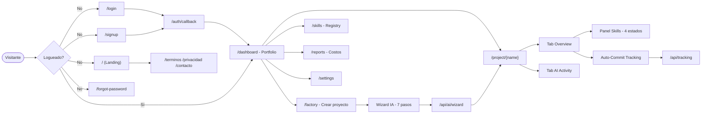
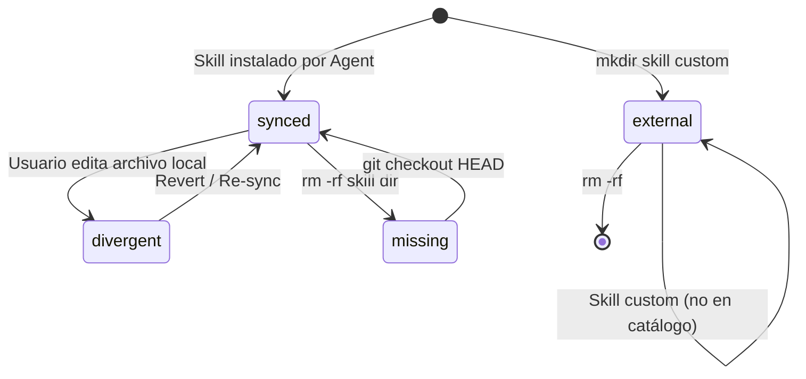
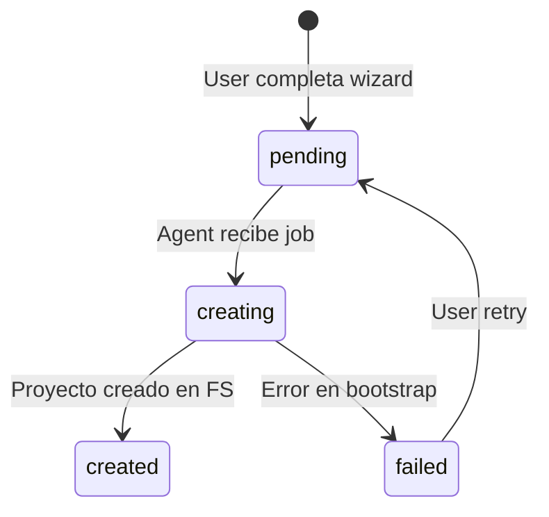
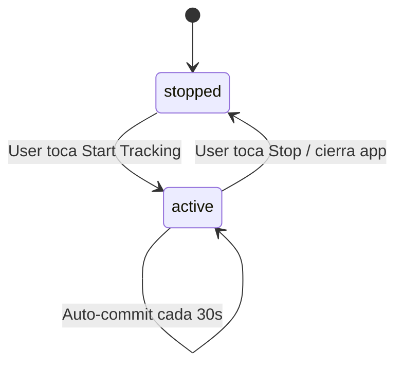
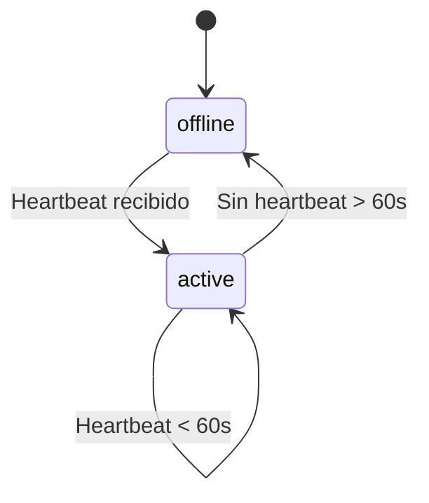

# Factory Manager — Workflow

> Última actualización: 2026-05-11
> Generado por skill `/flow-map`

## 1. Resumen narrativo

Factory Manager es un **Business OS para gestionar una fábrica de software**. Permite al dueño de la fábrica ver todos sus proyectos SaaS en un solo dashboard, monitorear cuánto tiempo y dinero invierte en cada uno, sincronizar los "skills" (capacidades reutilizables) entre un catálogo central y cada proyecto, y generar reportes de costo por hora.

Hoy lo usa principalmente el founder. En el roadmap se contempla habilitar acceso a un **operador técnico** (mantenimiento día-a-día) y a **clientes finales** (que vean solo su proyecto). Esa segmentación llega con el sistema de roles vía `/add-security`.

---

## 2. Personajes (quién la usa)

| Personaje | Qué busca | Pantalla principal | Estado |
|-----------|-----------|-------------------|--------|
| **Founder (Ricardo)** | Visión total del portfolio, costos, decisiones de negocio | `/dashboard` | ✅ activo hoy |
| **Operador técnico** | Mantener proyectos sincronizados con catálogo, levantar tracking, ver actividad | `/project/[name]`, `/skills` | 🛣️ roadmap |
| **Cliente final** | Ver SOLO su proyecto, su gasto, pedir features nuevas | `/project/[su-name]` (filtrado) | 🛣️ roadmap |

> **Nota crítica:** hoy el Manager no diferencia roles. Todos los usuarios autenticados ven todo. La segmentación de operador/cliente es trabajo futuro (dependiente de `/add-security`).

---

## 3. Screen flow (mapa de pantallas)

---

## 4. State diagrams

### Entidad: `project_skills` (sync state)

El estado más importante del Manager — cuatro estados derivados comparando hashes locales vs el catálogo central. Los valida y los rendea el `<SkillPanel>`.

### Entidad: `projects.agent_status` (creación por Agent)

### Entidad: tracking session

### Entidad: Agent connection

---

## 5. Event catalog (mensajes que ve el usuario)

| Evento (interno) | Trigger | Mensaje al usuario | Dónde aparece |
|-----------------|---------|-------------------|---------------|
| `skill_synced` | hash local = registry | "Sincronizado con catálogo" (tooltip) | Badge verde en SkillPanel |
| `skill_divergent` | hash local ≠ registry | "Difiere del catálogo" (tooltip) | Badge ámbar en SkillPanel |
| `skill_missing` | local_hash NULL | "Falta el skill" (tooltip) | Badge rojo en SkillPanel |
| `skill_external` | registry_hash NULL | "Skill custom" (tooltip) | Badge gris en SkillPanel |
| `tracking_started` | toggle Start | "Tracking activo" + dot pulse verde | Card Auto-Commit en project detail |
| `tracking_stopped` | toggle Stop | "Auto-Commit Tracking" (placeholder) | Card Auto-Commit |
| `tracking_error` | API falla | "Error al iniciar/detener tracking" | Inline rojo bajo card |
| `agent_active` | heartbeat reciente | "Hace Xs / Xm / Xh" | Header del Agent card |
| `agent_offline` | sin heartbeat | "offline" o ausencia de timestamp | Header Agent |
| `wizard_progress` | step actualizado | "Paso N de 7" + progress bar | `/factory` wizard |
| `agent_command_disabled` | feature no implementada | "⚠ Disponible próximamente vía Agent" (tooltip) | Botones de acción en wizard |
| `github_empty` | sync vacío | "Sin orgs cacheadas. Hacé click en 'Refresh from GitHub'" | Settings |
| `archived_empty` | filtro sin resultados | "No hay proyectos archivados" | Settings |
| `auth_error` | login falla | Mensaje del provider (Google/Supabase) | Login form |
| `signup_success` | cuenta creada | Redirect a `/auth/callback` → `/dashboard` | Flow auth |

---

## 6. Intent map (frases naturales → acciones)

> **Núcleo del asistente AI**. Cada fila es una capacidad que el chatbot expone como tool/intent.
> Marcas: 🟢 disponible hoy · 🟡 requiere lógica nueva · 🔴 requiere `/add-security` (roles)

### Founder (vos)

| Frase del usuario | Intención | Acción / target | Estado |
|-------------------|-----------|----------------|--------|
| "muéstrame todos mis proyectos" | list_portfolio | navegar a `/dashboard` | 🟢 |
| "abrime el de [nombre]" | open_project | navegar a `/project/{name}` resolviendo por nombre fuzzy | 🟢 |
| "¿qué proyectos tienen problemas?" | filter_problematic | `/dashboard` filtrando skills con estado != synced | 🟡 |
| "¿cuánto gasté este mes?" | cost_total | leer `claude_sessions` agregado por mes | 🟢 |
| "¿cuánto le metí a X esta semana?" | time_invested | leer `work_sessions` filtrado por project + week | 🟢 |
| "creame un proyecto nuevo de [idea]" | new_project | navegar a `/factory` con preset del tema | 🟢 |
| "¿cuánto facturo por hora?" | hourly_rate | leer `/reports` y mostrar promedio $/h | 🟢 |
| "borrá este proyecto" | delete_project | confirmar 2x, soft-delete (`status='archived'`) | 🟡 |

### Operador técnico

| Frase del usuario | Intención | Acción / target | Estado |
|-------------------|-----------|----------------|--------|
| "sincronizá este proyecto con el catálogo" | sync_project | trigger Agent `sync` command para project_id | 🟡 |
| "aplicá el skill X a Y" | apply_skill | trigger Agent `apply-skill` con skill_id + project_id | 🟡 |
| "¿por qué add-emails está raro?" | explain_skill_state | leer `project_skills.status` + glosario | 🟢 |
| "arreglá los skills divergentes" | bulk_resync | sync de todos los skills con status=divergent | 🟡 |
| "levantale el tracking" | start_tracking | POST `/api/tracking` start | 🟢 |
| "¿qué máquina pusheó último?" | last_commit_machine | leer última fila de `wip` commits y devolver hostname | 🟢 |
| "borrá este proyecto" | delete_project | **no autorizado** → "Esa acción la tiene que aprobar el founder" | 🔴 |
| "cambiá el pricing" | edit_pricing | **no autorizado** | 🔴 |

### Cliente final

| Frase del usuario | Intención | Acción / target | Estado |
|-------------------|-----------|----------------|--------|
| "mostrame mi proyecto" | open_my_project | navegar a `/project/{own_name}` (scope por user_id) | 🔴 |
| "¿cómo va mi app?" | project_health | leer `agent_status`, último commit, skills problemáticos | 🔴 |
| "¿cuánto llevo gastado?" | client_cost | leer cost agregado de SU proyecto solo | 🔴 |
| "necesito una feature nueva" | request_feature | crear ticket / mandar mensaje al founder | 🔴 |
| "¿cuándo está lista?" | eta_project | leer roadmap del proyecto si existe, sino devolver "consultá al equipo" | 🔴 |
| "se rompió / no anda" | report_incident | crear incident report + notificar founder | 🔴 |
| "está caro" | review_billing | mostrar breakdown de costos | 🔴 |
| "ese de [tema]" | fuzzy_project_search | resolver nombre por categoría/keyword | 🟡 |

---

## 7. Glosario (técnico → humano)

| Término técnico | Traducción no-técnica |
|----------------|----------------------|
| **synced** | "Todo en orden, no hay diferencias entre tu proyecto y el catálogo central" |
| **divergent** | "El skill local tiene cambios que no están en el catálogo. Alguien lo editó directo" |
| **missing** | "El skill desapareció del proyecto pero queda registrado. Probablemente lo borraron sin querer" |
| **external** | "Es un skill custom de este proyecto, no existe en el catálogo central" |
| **skill** | "Una capacidad reutilizable — un módulo que sabe hacer algo concreto (ej: agregar login, mandar emails)" |
| **catálogo / registry** | "La biblioteca central de skills compartidos entre todos tus proyectos" |
| **Agent** | "Un programa que corre en tu computadora y mantiene tus proyectos en sincronía con la nube" |
| **tracking** | "Modo que guarda automáticamente lo que escribís cada 30 segundos. Útil para no perder trabajo" |
| **auto-commit** | "Cuando tracking está activo, cada cambio se guarda en git solo. No tenés que pensarlo" |
| **wip** | "Commits automáticos del Agent. Significan 'trabajo en progreso, no es una versión final'" |
| **portfolio** | "La pantalla con todos tus proyectos juntos. Tu vista de fábrica" |
| **factory** | "El asistente que te ayuda a crear un proyecto nuevo desde una idea" |
| **registry hash / local hash** | "Una huella digital que prueba que dos versiones del skill son iguales. Si la huella cambia, hubo edición" |
| **RLS** | "Reglas de seguridad de la base de datos: cada usuario solo puede ver lo suyo" |
| **profile** | "Tu perfil de usuario dentro del Manager" |

---

## 8. Notas para el asistente IA

> Esta sección se lee como parte del system prompt del `fluya-ai-agent`.

### Tono
- Argentino, amigable, sin jerga técnica
- Tutea al usuario ("vos")
- Si el usuario es técnico (lo notás por su vocabulario), podés ser un poco más preciso
- Si el usuario es no-técnico, traducir SIEMPRE usando el glosario

### Reglas duras
- **Nunca** exponer IDs internos (uuid, project_id) al usuario salvo que pregunte expresamente
- **Nunca** ejecutar acciones destructivas (delete_project, sync masivo) sin confirmación doble explícita
- Si una intención no está en el intent map, responder: *"No estoy seguro de cómo hacer eso todavía. ¿Podés contarme un poco más?"*
- Si el usuario pregunta algo que requiere `/add-security` (scope por rol) y no está implementado, responder: *"Todavía no tenemos esa función — está planeada para cuando agreguemos sistema de roles."*
- Para preguntas sobre estado de skills, SIEMPRE leer el estado actual de la DB antes de responder. No asumir.
- Si el usuario reporta un bug ("no anda", "se rompió"), pedir contexto: ¿qué pantalla, qué pasó, qué esperabas?

### Coloquialismos a interpretar (cliente final principalmente)
- "se rompió" / "no anda" → reportar incidente, pedir más info
- "está caro" → mostrar breakdown de billing del proyecto del usuario
- "ese de [tema]" → buscar proyecto por categoría o nombre fuzzy
- "está fuera de fase" → skill divergent
- "no aparece" → posible filtro activo o estado missing — chequear primero
- "se quedó cargando" → revisar console/network, ofrecer reload

### Preguntas típicas en error y cómo responder

| Pregunta del usuario | Respuesta sugerida |
|---------------------|-------------------|
| "¿por qué no se sincronizó X?" | Leer última `wip` commit del repo + estado del Agent. Si Agent offline → "El Agent está dormido, despertalo desde Settings". Si online → revisar logs del último sync |
| "¿dónde está mi proyecto, no aparece?" | Chequear filtros activos. Si no hay filtros → buscar en archivados. Si tampoco → "No lo encuentro, ¿lo creaste con este usuario?" |
| "¿por qué dice ámbar y no rojo?" | Explicar diferencia: ámbar = el skill EXISTE pero tiene cambios. Rojo = el skill NO existe en disco. Linkear al glosario |
| "se quedó cargando, ¿qué pasa?" | Pedir hard reload (Cmd+Shift+R). Si persiste, revisar consola del navegador o el log del Agent |

### Ejemplos de buenas respuestas

**User (no técnico):** "¿por qué add-emails está raro en SaasFactoryManager?"
**Assistant:** "Está marcado como 'divergent' — eso significa que el archivo local del skill tiene cambios que no están en el catálogo central. Probablemente alguien lo editó directo en ese proyecto. Si querés que vuelva a estar igual al catálogo, podés hacer 'Re-sync'. Si los cambios locales son intencionales, hay que pushearlos al catálogo desde el SF Agent."

**User (founder):** "¿cuánto gasté este mes?"
**Assistant:** "Dejame ver… {leer claude_sessions, agregar por proyecto, formatear}. Este mes (mayo 2026) llevás $X en total. El proyecto más caro fue {top1} con $Y. ¿Querés que te lo abra en /reports?"

---

> **Cómo regenerar este archivo**: ejecutar `/flow-map` en la raíz del proyecto.
> En modo update, el skill detecta este archivo y solo pregunta lo que cambió desde la última versión.
